# Project Title - Rent Prices Trend for City of Stillwater
*From Orange Intelligence Bureau*
*`Divya Pamu`, `Isabella Lieberman`, `Omkar Patade`, `Roe Djer Tan`*  

## Executive Summary

Since coronavirus pandemic has happened all over the globe with numerous lockdowns being enforced, the global economy and property market have been seriously affected as human activities have changed drastically, for example, remote learning and work from home have been a norm. The United States including Oklahoma is also one of the heavily stricken regions. Consequently, as students from Oklahoma State University (OSU), a few concerns come to our attention: 
- Has rental rate in Oklahoma especially Stillwater (Payne County) changed?
- How has the demographics of Stillwater impact rent prices?

Our main idea is to show trend on rent prices as well demographics variable (without biasing races) in Stillwater, Payne County, Oklahoma. Having access to a rent price trend can help realtors and investors as well as incoming college students and adults in decision making for investment or residing in Stillwater in near future as duration for it to remain affordable could be forecasted. 

### Business Opportunity
1. Charles (2022) states that several rent and utilities financial aids have been offered to mitigate economic impact caused by the pandemic. Since economy is in a recovery phase, prediction for Stillwater rent prices is crucial to provide interested parties insights for a better financial and risk management. 
2. “Stillwater ranked No. 9 and Norman landed at No. 11 for most affordable rents in a survey of cities large and small by Rent.com” (Mize, 2022). Having access to a rent price trend can help realtors and investors as well as incoming college students and adults in decision making for investment or residing in Stillwater in near future as duration for it to remain affordable could be forecasted.  

### Team Members of *Orange Intelligence Bureau*:
- `Divya Pamu` 
- `Isabella Lieberman`
- `Omkar Patade`
- `Roe Djer Tan`

## Statement of Scope
### Project Objectives
- To provide trend of rent prices (in US Dollars) in Stillwater
- To show relationship between trend of rent prices and demographic variables in Stillwater including population age, property values, and OSU enrollment without biasing races.

### Unit of Analysis
Rent price is the unit of analysis.  

## Project Schedule
The team estimated that a timeframe of 12-14 weeks to extract, transform, and load data as well as visualize data with insights finding. The schedule is as shown below:  

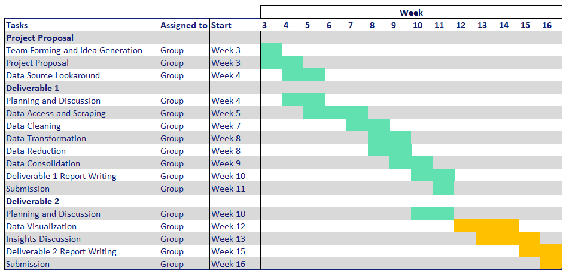  

## Data Preparation
Our data preparation overview could be categorized into 3 parts: Extract, Transform, and Load.
### Extract
Raw data (external sources) was extracted from websites through Python Selenium. 
### Transform
Raw data required data processing or cleaning before it could be applied for intended use. Data transformation included, but not limited to, columns and rows selection(e.g., keep only observations related to Stillwater/Payne County), keys (`Year` as primary key in this case) generation to facilitate joining processes, deriving new columns by calculations, removing null or duplicated values, data aggregations and summarizations, sorting and ordering, column splitting, and data transposing.
### Load
The cleaned data was loaded into a GitHub repository that was accessible to every member in the team to facilitate version control and visualization process. The benefits of using GitHub repository: it ensures that everyone has the latest cleaned data from the same source (data quality and consistency) as data cleaning may be a recurring process, every update history is recorded, it is well-organized, and it facilitates future analytics processes. 

### Sources for our Data
1. [datauso.io (Stillwater, Ok)](https://datausa.io/profile/geo/stillwater-ok) 
- Stillwater/Payne County – housing and property values over time, homeownership, age distribution, household income, employment by industry, domestic trade data 
Raw tables:
[property_value](data/raw/property_value), [Rent vs Own](data/raw/rent_own/Rent%20vs%20Own.csv), [Age by Nativity](data/raw/age_nativity/Age%20by%20Nativity.csv), [Household Income](data/raw/datausa_hh_income/Household%20Income.csv), [Employment by Industries](data/raw/emp_industry/Employment%20by%20Industries.csv), [Domestic Trade Growth](data/raw/trade_growth/Domestic%20Trade%20Growth.csv).

2. [Rent Price in Payne County from Census Bureau](https://data.census.gov/cedsci/table?q=Renter%20Costs&g=0400000US40_0500000US40119&tid=ACSDT1Y2021.B25031) 
- Census data for median rent prices in Oklahoma as well as Payne County over the years. 
Raw tables: *`census_rent_2015` to `census_rent_2021`* from [census_rent](data/raw/census_rent) folder.

3. [datauso.io (Oklahoma State University)](https://datausa.io/profile/university/oklahoma-state-university-main-campus) 
- Oklahoma State University's data that has values for number of students enrolled over a Year over Year (YoY) basis. 
Raw table: [Full-Time vs Part-Time Enrollment](data/raw/enrollment_status/Full-Time%20vs%20Part-Time%20Enrollment.csv)  

### Files and Folder Directory
* `/assets`: Contans image files, pdf, and other non-programming files. 
* `/code`: Python script files are stored here. 

| Coding File | Description |
| :--- |:---|
| [rent_price.py](code/rent_price.py) | Scraping and transformation of rent data (response variable).  |
| [independent_variables.py](code/independent_variables.py) | Scraping of all predictor data. |
| [IV_transformation.py](code/IV_transformation.py) | Transformation of all predictor data. |
| [data_consolidation.py](code/data_consolidation.py) | Consolidation of all potential data into [final_rent.csv](data/consolidated/final_rent.csv). |
| [viz_1.R](code/viz_1.R) | Visualizing *Rent Price Trend in Stillwater from 2015 to 2020*. |
| [viz_2.R](code/viz_2.R) | Visualizing for *Rent Price Trend in Stillwater vs. OSU Enrollment*. |
| [viz_3.R](code/viz_3.R) | Visualizing for *Rent Price vs. Property Value in Stillwater*. |
| [viz_4.R](code/viz_4.R) | Visualizing for *Rent Price vs. Population Age in Stillwater*. | 

* `/data`: Contains Datasets.

| Folder | Description |
| :--- |:---|
| [raw](data/raw) | Storing scraped raw dataset csv files. |
| [transformed](data/transformed) | Storing cleaned, transformed, and reduced dataset csv files. |
| [consolidated](data/consolidated) | Storing consolidated dataset csv file. |
 

## Data Access

### Rent Prices
- Website: [Rent Price in Payne County from Census Bureau](https://data.census.gov/cedsci/table?q=Renter%20Costs&g=0400000US40_0500000US40119&tid=ACSDT1Y2021.B25031) 
- Brief Description: Census data for median rent prices in Oklahoma as well as Payne County over the years. 
- Code: [rent_price.py](code/rent_price.py)
- Raw Tables: *`census_rent_2015` to `census_rent_2021`* from [census_rent](data/raw/census_rent) folder. 

Steps: 
1. `webdriver.Firefox` from Selenium was used to navigate to the website mentioned. The interface of the website is as shown: 
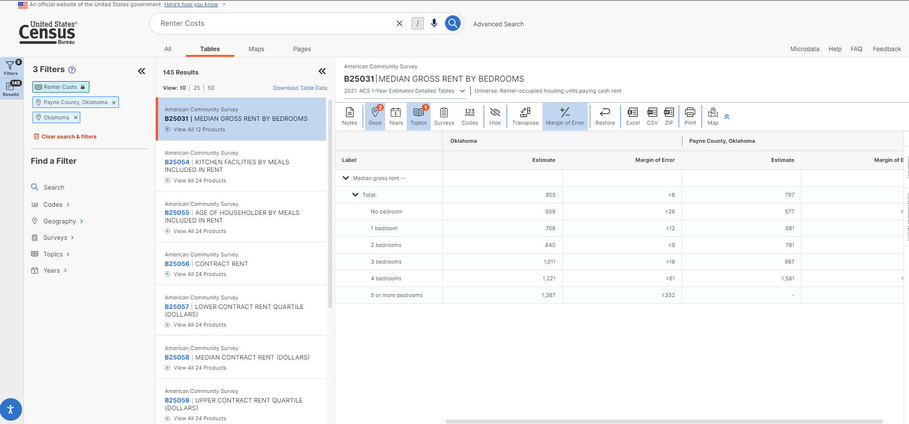 

This website showed the median rent by bedrooms in Oklahoma and Payne County in 2021. We were interested in the data on the right. There were 3 columns we were interested in: `Label`, `Oklahoma Estimates`, and `Payne County Estimates`.

2. After using browser developer mode, XPath for `Label` column was located - `//span[@class='ag-group-value']`. Then, we applied `find_elements` to extract all elements in `Label` column. Then, `for` loops were used to assign each of the element into a list to facilitate dataframe forming process.

3. The same processes in step 2 were applied to other interested columns with different XPath as shown below: 
- Oklahoma Estimates: `//div[@class='ag-center-cols-container']/div/div[1]`
- Payne County Estimates: `//div[@class='ag-center-cols-container']/div/div[3]`

4. We were done scraping rent information for 2021. For 2020 rent information, we located the XPath for the dropdown list (dropdown list was located above the table with text of `2021: ACS 1-Year Estimates Detailed Tables` in the website interface) which was `//div[@class='aqua-flex nowrap']` and Selenium's `click` was applied to click on the dropdown list. The dropdown list is as shown: 
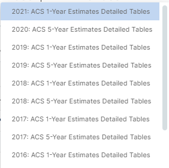

5. Then, we located the XPath for 2020 rent information with text of `2020: ACS 5-Year Estimates Detailed Tables` which was `//div[@class='aqua-menu-item px-3 py-2']//span[@class='data-opt-ACSDT1Y2019.B25031']` and Selenium's `click` was applied to navigate into the website containing 2020 rent information.

6. The same processes in step 2 and 3 were applied to scrape 2020 rent information. After scraping, the same processes in step 4 and 5 were applied to navigate to the next webpage containing 2019 rent information. We iterated and scraped rent information from year 2020 to 2015 with the same processes above.

7. After preliminary data transformation (for more details please refer to data transformation section) to ease dataframe forming, we exported the file to [census_rent](data/raw/census_rent) as csv and defined it as raw file.

*Note that only 2020 rent information was 5-year estimates while the other years are 1-year estimates. It happened due to inavailability of the census data that might be resulted from coronavirus outbreak*  

### Other Variables from Datausa.io
- Website: [datauso.io (Stillwater, Ok)](https://datausa.io/profile/geo/stillwater-ok) 
- Detailed Website (click to navigate):
    - [Household Income Webpage](https://datausa.io/profile/geo/stillwater-ok#household_income)
    - [Property Value Webpage](https://datausa.io/profile/geo/stillwater-ok#property_value)
    - [Rent vs Own Webpage](https://datausa.io/profile/geo/stillwater-ok#rent_own)
    - [Domestic Trade Growth Webpage](https://datausa.io/profile/geo/stillwater-ok#trade_growth)
    - [Employment by Industry Webpage](https://datausa.io/profile/geo/stillwater-ok#tmap_ind_num_emp)
    - [Age By Nativity Webpage](https://datausa.io/profile/geo/stillwater-ok#age_nativity)
    - [Enrollment Data Webpage](https://datausa.io/profile/university/oklahoma-state-university-main-campus#enrollment_status)

- Brief Description: Stillwater/Payne County – housing and property values over time, homeownership, age distribution, household income, employment by industry, domestic trade data 
- Code: [independent_variables.py](code/independent_variables.py)
- Raw Tables: [property_value](data/raw/property_value), [Rent vs Own](data/raw/rent_own/Rent%20vs%20Own.csv), [Age by Nativity](data/raw/age_nativity/Age%20by%20Nativity.csv), [Household Income](data/raw/datausa_hh_income/Household%20Income.csv), [Employment by Industries](data/raw/emp_industry/Employment%20by%20Industries.csv), [Domestic Trade Growth](data/raw/trade_growth/Domestic%20Trade%20Growth.csv), [Full-Time vs Part-Time Enrollment](data/raw/enrollment_status/Full-Time%20vs%20Part-Time%20Enrollment.csv). 

Steps: 
1. We changed `webdriver.Firefox` download directory to allow the downloaded csv file be directed into our preferred destination. 

2. `webdriver.Firefox` from Selenium was used to navigate to the website containing data for `household income`. The interface of the website was as shown: 
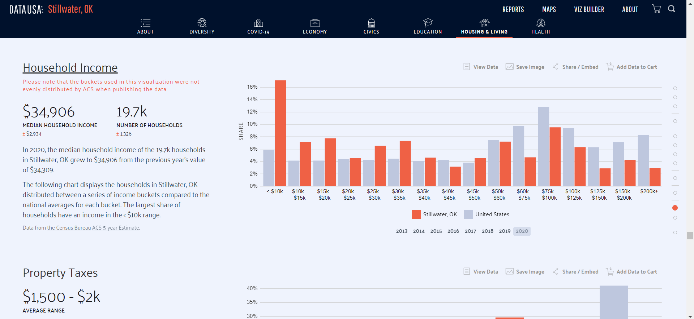 

3. We located the XPath for clickable `View Data` which was `//div[@class='topic household_income TextViz ']//span[@class='option-label']` and Selenium's `click` was applied. The interface is as shown:  
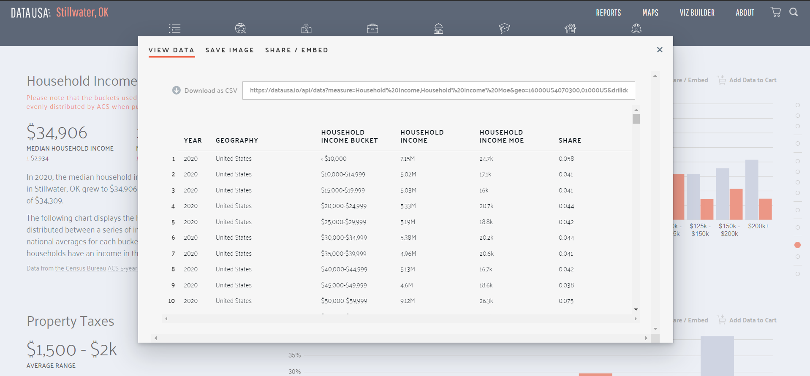 

4. Then, we located the XPath for clickable `Download as CSV` which was `//button[@class='bp3-button bp3-icon-download bp3-minimal` and Selenium's `click` was applied. Then, the zip file was downloaded to set directory.

5. `extractall` from `zipfile` was applied to extract and obtain the csv file for `Household income` containing the data we were interested.

6. The same processes from step 1 to 5 were applied to rest of the data from datausa.io.

*Note that we applied `Download as CSV` instead of directly scrape the table using XPath to locate the elements. This was because whenever we tried to scroll down the table using Selenium, the previous information in the table was removed from the html resulting that we were not able to have all elements from the table to be in its html at once*  

## Data Cleaning
Before cleaning and transforming, we applied `.info()` to check the structure and details of dataframe. For example, 
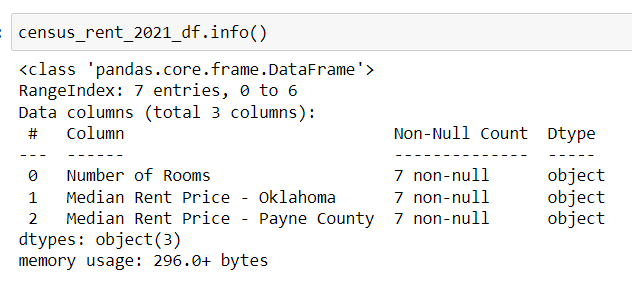

We also applied `.head()` to check how the first few observations looked like. For example, 
 

### Dropping Column with Only 1 Unique Value
Code: [IV_transformation.py](code/IV_transformation.py) 
We used `.nunique()` to check the value uniqueness in every column. If columns containing only 1 unique value and providing no useful information, they were dropped by using `for` loop with `drop` function. 

Before dropping:  
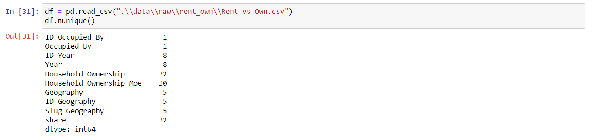 

After dropping:  
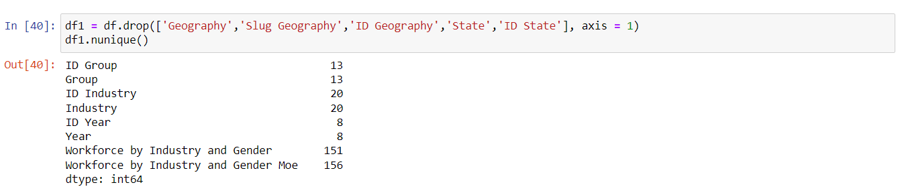 

### Dropping Duplicates
Code: [IV_transformation.py](code/IV_transformation.py) 
`.drop_duplicates()` was used to drop any rows that are duplicated as duplicated rows would result into erroneous analysis affecting aggregation and visualization. The sample code for dropping duplicates is as shown: 

`property_value_df = property_value_df.drop_duplicates()` 

### Dropping Unnecessary Columns
Code: [IV_transformation.py](code/IV_transformation.py) 
After dropping columns containing only 1 unique value and providing no useful information, we also observed that there were a lot of unneccessary columns based on business sense or perceiving that information in the columns were duplicated.

For example for `rent_own_df`, columns of `ID Year`, `Household Ownership Moe`, `ID Geography`, `Slug Geography` were unnecessary columns.

Those columns providing no values for analysis were dropped with following code: 
`rent_own_df=rent_own_df.drop(['ID Year', 'Household Ownership Moe', 'ID Geography', 'Slug Geography'], axis=1)` 

### Data Type Conversion
Code: [rent_price.py](code/rent_price.py) 
After checking with `.info()`, we found that data scraped from census bureau are all in `string` type, we were required to convert the median rent prices into `float` for imputation of null values as well as for the analysis and visualization. The example code to convert them from `string` to `numeric` is as shown below:  

`overall_census_rent_df[['Total','No bedroom','1 bedroom','2 bedrooms','3 bedrooms','4 bedrooms','5 or more bedrooms']] = overall_census_rent_df[['Total','No bedroom','1 bedroom','2 bedrooms','3 bedrooms','4 bedrooms','5 or more bedrooms']].apply(pd.to_numeric).astype('Float64')` 

### Null Imputation
Code: [rent_price.py](code/rent_price.py) 

We checked if dataframe containing nulls using `isnull().sum()`. The only dataframe with nulls was rent price. It is as shown below: 
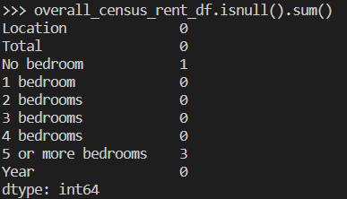 

Before moving on into imputation, we checked if the skewness of the affected columns is between -2 and 2 (if it is, it is close to normal). This guided us on method selection for imputation. The skewness inspection is as shown: 
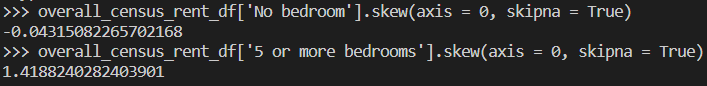 

Since the skewness of the distribution was close to normal, we used mean imputation as follows: 
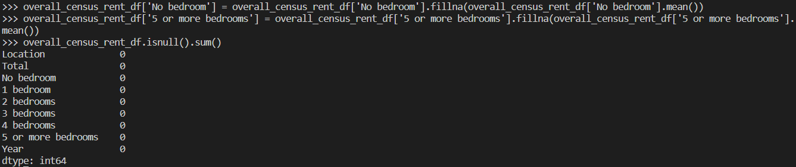 

## Data Transformation:
Raw data requires data processing or cleaning before it can be applied for intended use. Data transformation may include, but not limited to, columns and rows selection(e.g., keep only observations related to Stillwater/Payne County), keys (`Year` as primary key in this case) generation to facilitate joining processes, deriving new columns by calculations, data aggregations and summarizations, column splitting, and data transposing.

### Punctuation Removal
Code: [rent_price.py](code/rent_price.py) 
Data containing punctuation was considered as `string` in Python. Therefore, punctuations were removed to facilitate data type conversion (into numeric). We assigned all possible punctuation to `punc` and then we used `for` loop to iterate through every character in every cell and `.replace()` was applied to replace all punctuation with nothing. 
Before removal: 
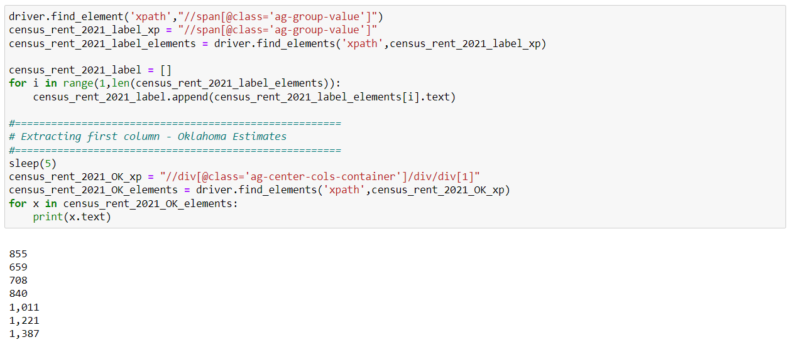 

After removal:  
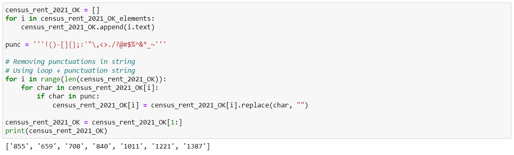 

### Transposing Dataframe
Code: [rent_price.py](code/rent_price.py) 
Transposing was applied to convert row values into columns, we applied that on rent price data to ensure that every row contained value of just respective years. The example is as shown below:  

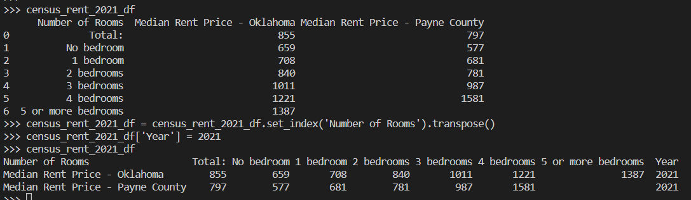 

### Restructuring Columns using `groupby`
Code: [IV_transformation.py](code/IV_transformation.py) 
Some raw dataframes were not well-structured. Therefore, we restructured them using `groupby` function. Below is the example of usage of `groupby` function: 

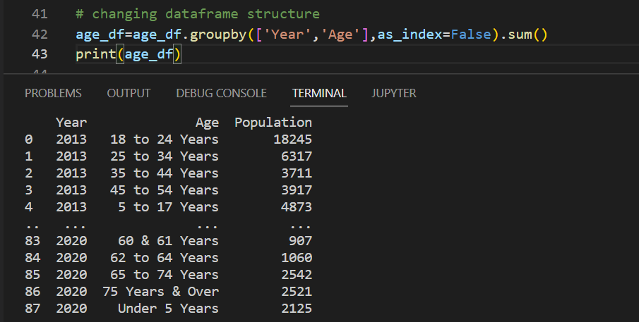 

### Constructing Population Dataframe From `stillwater_age_population` csv File
Code: [IV_transformation.py](code/IV_transformation.py) 
Stillwater population data for each year was derived from [stillwater_age_population.csv](data/transformed/age_population/stillwater_age_population.csv) using the following codes: 

`population_df = age_df.drop(['Age_Min','Age_Max'], axis=1).groupby(['Year']).sum()` 

### Splitting Interval Columns for Further Calculation
Code: [IV_transformation.py](code/IV_transformation.py) 
We converted some interval variables to 2 columns to lay a foundation to calculate median for data consolidation where each year was consolidated to one row.  

For example, we converted the interval `Age` in age dataframe into columns `Age_Min` and `Age_Max` using regular expression using the code below: 

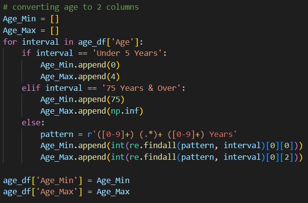 

Result: 
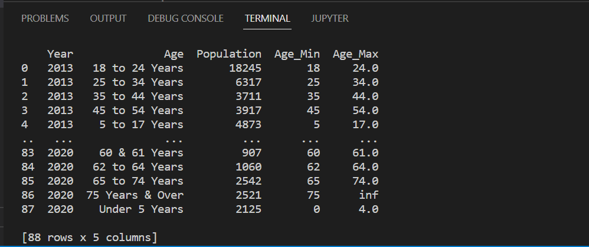 

### Renaming Column
Code: [IV_transformation.py](code/IV_transformation.py) 
Some column headers from raw files were misleading. Therefore, we renamed the column headers prevent confusion. The example code and result are as shown below: 
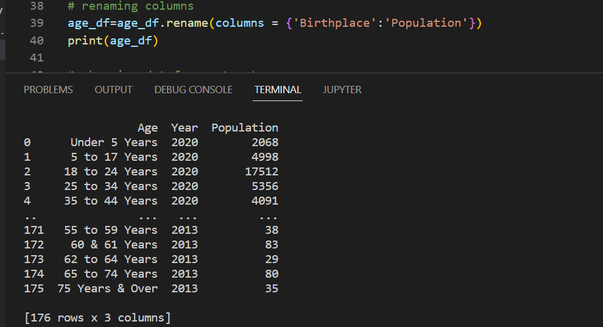 

### Sorting Columns
Code: [IV_transformation.py](code/IV_transformation.py) 
Sorting columns on `Year` variable were done to maintain consistency of dataframes and ease of viewing. The example is shown below: 
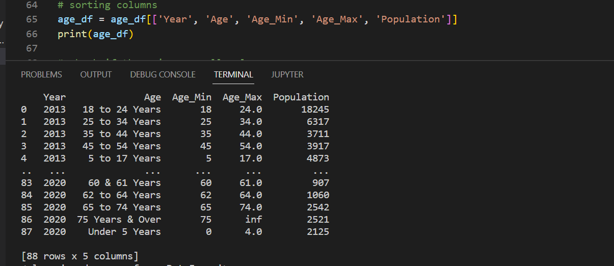 

### Creating Median (Grouped Data)
Code: [data_consolidation.py](code/data_consolidation.py) 
Some of the independent variables, such as age, household income and property value, had many bins for the same year. So, in order to consolidate these rows, we calculated median value for age, household income, and property value and used those statistics as our representative value for that year. Median (for grouped data) was calculated using the following function: 
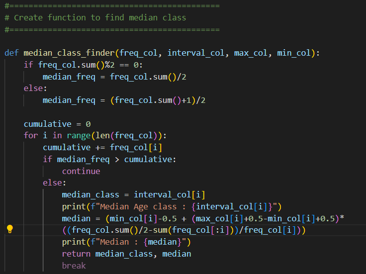 

### Recoding Values before Visualization
Code: [viz_1.R](code/viz_1.R), [viz_2.R](code/viz_2.R), [viz_3.R](code/viz_3.R), and [viz_4.R](code/viz_4.R) 
Some of the transformations were done right before visualization. Recoding was one of them. The purpose of recoding was to minimize the length of the values so that it was not presented in a confusing and messy way in visualizations. For example, by using `recode` function in R, we minimized the values for number of rooms from `Overall.Median.Rent` to `Overall`, from `No.bedroom` to `None`, from `X1,bedroom` to `One`, and so on. The code and output for mentioned are as shown: 

Before recoding: 
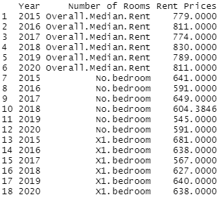 

After recoding: 
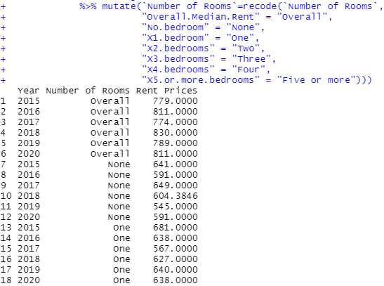 

### Constructing New Column Before Visualization
Code: [viz_1.R](code/viz_1.R), [viz_2.R](code/viz_2.R), [viz_3.R](code/viz_3.R), and [viz_4.R](code/viz_4.R) 
Some of the new column creations were not done prior to data consolidation because they would just make the csv file more complicated and messy. Therefore, we did it right before visualization. For example, we created a new column `before_covid` to facilitate `geom_tile` application to show before and after COVID outbreak in visualizations. The example code and output are as shown:  
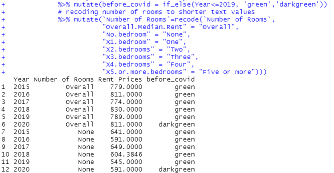 

### Unpivot Columns and Summarisation Before Visualization
Code: [viz_2.R](code/viz_2.R), [viz_3.R](code/viz_3.R), and [viz_4.R](code/viz_4.R) 

Based on our consolidated data [final_rent.csv](data/consolidated/final_rent.csv), the rent prices were divided into few columns including Overall Median Rent, No bedroom, 1 bedroom, 2 bedrooms, 3 bedrooms, 4 bedrooms, 5 or more bedrooms. In order to ease visualization through `ggplot`, we unpivoted them into three columns using `melt` with `Year` as ID, `Rent Prices` as value, `Number of Rooms` as the variable storing column header values. The example is as shown: 

Before unpivoting:  
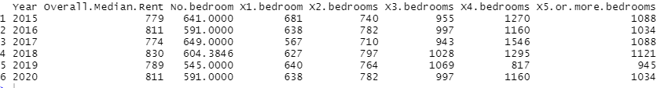 

After unpivoting: 
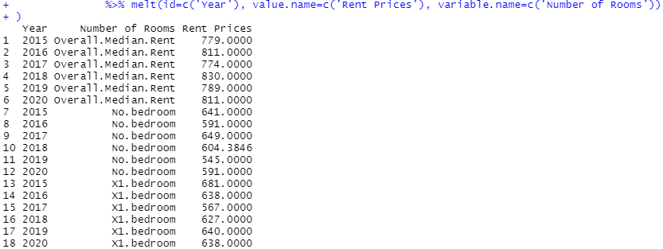 

Then, based on the unpivoted dataframe, we applied `group_by` and `summarise` to narrow the `Number of Rooms` down to only 2 values which were `2 rooms or less` and `3 rooms or more` (after removing `Overall.Median.Rent`). We did this because we did not wish to have too many different rent prices making our visualization unfriendly to view. The example code and output are as shown: 
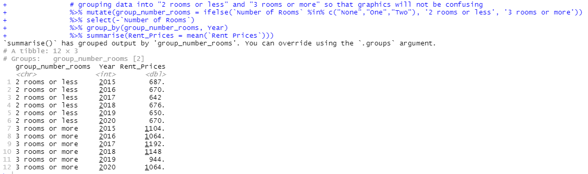  

## Data Reduction
Code: [IV_transformation.py](code/IV_transformation.py) 
Since we had removed unnecessary columns and duplicated values, for this section, we only focused on reducing rows to keep worthy data in our dataframe. 

We kept the data related to Oklahoma State University because our main idea was to display trend of rent prices in Stillwater, Payne County, Oklahoma. 

The code that we used with regular expression is: 
`enrollment_df = enrollment_df[enrollment_df['University'].str.contains('(?:Oklahoma State)')]` 

The data frame before data reduction. 
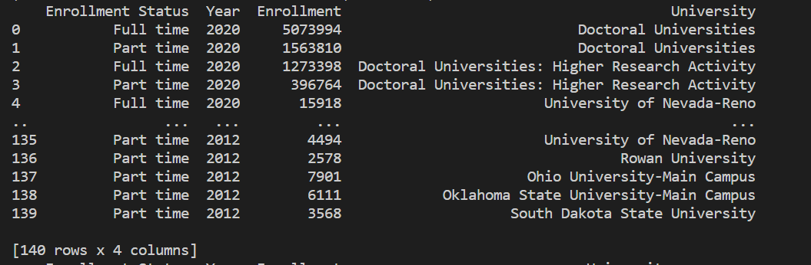 

The data frame after data reduction. 
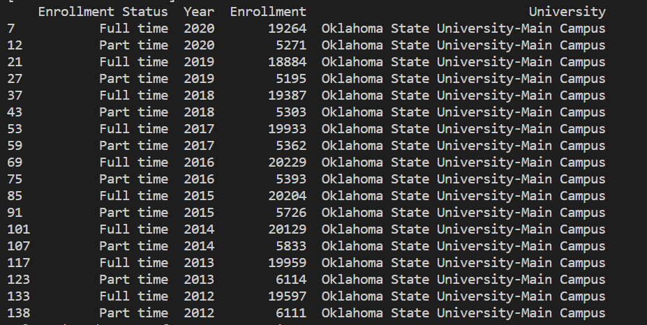 

## Data Consolidation
Every transformed csv file were consolidated into a year a row to avoid complexity of final csv file.

### Filtering using Regular Expression
Code: [data_consolidation.py](code/data_consolidation.py) 
Some of the dataframes contained data that was not suitable for final csv file, for example, `Geography` in `rent_own_df` other than `Payne County`. However, those data were still valuable and worth keeping for the other analysis and visualization. Therefore, for final csv file, we selected only data that was related using regular expression, for example, selecting Stillwater/Payne County for geography location. The example code is as shown below: 

`rent_own_df = rent_own_df[rent_own_df['Geography'].str.contains('(?:Payne)')]` 

### Merging and Joining
Code: [data_consolidation.py](code/data_consolidation.py) 
After making sure every potential dataframe was consolidated, we merged them together using inner join on `Year` key. The example code is as shown below: 

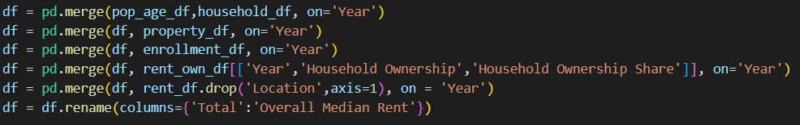 

Merged data was output as [final_rent.csv](data/consolidated/final_rent.csv) 

## Data Dictionary

### Consolidated csv File ([final_rent.csv](data/consolidated/final_rent.csv)): 

| Attribute Name | Description | Data Type | Source | Data | Example |
| :--- |:--- | :--- |:--- | :--- |:--- |
| Year | The year for which the observation is for | integer | https://data.census.gov/ | [final_rent.csv](data/consolidated/final_rent.csv) | 2021 |
| Median Age | The median age of the population | float | https://datausa.io/ | [final_rent.csv](data/consolidated/final_rent.csv) | 23.67671095791405 |
| Population | Population of the area | integer | https://datausa.io/ | [final_rent.csv](data/consolidated/final_rent.csv) | 47523 |
| Median Household Income | Median household income for the area | float | https://datausa.io/ | [final_rent.csv](data/consolidated/final_rent.csv) | 	32241.652466367712 |
| Household Counts | Number of Housholds | integer | https://datausa.io/ | [final_rent.csv](data/consolidated/final_rent.csv) | 18080 |
| Median Property Value | Median Property valuation of houses | float | https://datausa.io/ | [final_rent.csv](data/consolidated/final_rent.csv) | 	185317.81187410586 | 
| Property Counts | Number of properties in the area | integer | https://datausa.io/ | [final_rent.csv](data/consolidated/final_rent.csv) | 6752 | 
| University | University Name | string | https://datausa.io/ | [final_rent.csv](data/consolidated/final_rent.csv) | Oklahoma State University-Main Campus	 | 
| Enrollment | Number of students enrolled in University | integer | https://datausa.io/ | [final_rent.csv](data/consolidated/final_rent.csv) | 25930 | 
| Household Ownership | Total Number of houses owned in the city | integer | https://datausa.io/ | [final_rent.csv](data/consolidated/final_rent.csv) | 15152 | 
| Household Ownership Share | Share of house owned by individuals ( Ranges from 0 to 1) | float | https://datausa.io/ | [final_rent.csv](data/consolidated/final_rent.csv) | 0.502320647129028 | 
| Overall Median Rent | Overall median price rent | float | https://data.census.gov/ | [final_rent.csv](data/consolidated/final_rent.csv) | 779.0 |
| No Bedroom | Median rent price for property without a bedroom |  float | https://data.census.gov/ | [final_rent.csv](data/consolidated/final_rent.csv) | 779.0 |
| 1 Bedrooms | Median rent price for property with 1 bedroom | float | https://data.census.gov/ | [final_rent.csv](data/consolidated/final_rent.csv) | 779.0 |
| 2 Bedrooms | Median rent price for property with 2 bedrooms | float | https://data.census.gov/ | [final_rent.csv](data/consolidated/final_rent.csv) | 779.0 |
| 3 Bedrooms | Median rent price for property with 3 bedrooms | float | https://data.census.gov/ | [final_rent.csv](data/consolidated/final_rent.csv) | 779.0 |
| 4 Bedrooms | Median rent price for property with 4 bedrooms | float | https://data.census.gov/ | [final_rent.csv](data/consolidated/final_rent.csv) | 779.0 |
| 5 or more bedrooms | Median rent price for property with 5 or more bedrooms | float | https://data.census.gov/ | [final_rent.csv](data/consolidated/final_rent.csv) | 779.0 |
 

### Age and Population ([stillwater_age_population.csv](data/transformed/age_population/stillwater_age_population.csv))

| Attribute Name | Description | Data Type | Source | Data | Example |
| :--- |:--- | :--- |:--- | :--- |:--- |
| Year | Year | integer | https://datausa.io/ | [stillwater_age_population.csv](data/stillwater_age_population.csv) | 2020 | 
| Age | Age range of bucket | integer | https://datausa.io/  | [stillwater_age_population.csv](data/stillwater_age_population.csv) | 18 to 24 years |
| Age_Min | Minimum age within age bucket | integer | https://datausa.io/ | [stillwater_age_population.csv](data/stillwater_age_population.csv) | 18 |
| Age_Max | Maximum age within age bucket | float (because contain `inf`) | https://datausa.io/ | [stillwater_age_population.csv](data/stillwater_age_population.csv) | 24.0 |
| Population | Number of people in Stillwater, Oklahoma that fit within the given age range during a specified year | integer | https://datausa.io/ | [stillwater_age_population.csv](data/stillwater_age_population.csv) | 18484 |  

### Employment by Industry ([emp_industry.csv](data/emp_industry.csv))
| Attribute Name | Description | Data Type | Source | Data | Example |
| :--- |:--- | :--- |:--- | :--- |:--- |
| Year | Year | integer | https://datausa.io/ | [emp_industry.csv](data/emp_industry.csv) | 2020
| Industry | Industry Name | string | https://datausa.io/ | [emp_industry.csv](data/emp_industry.csv) | Education |
| Workforce | Number of People in the Industry | integer | https://datausa.io/ | [emp_industry.csv](data/emp_industry.csv) | 2451 |
 

### Student Enrollment ([enrollment.csv](data/enrollment.csv))

| Attribute Name | Description | Data Type | Source | Data | Example |
| :--- |:--- | :--- |:--- | :--- |:--- |
| Year | Year | integer | http://www.company.org | [enrollment.csv](data/enrollment.csv) | 2020 |
| University | Name of University | string | https://datausa.io/ | [enrollment.csv](data/enrollment.csv) | Oklahoma State University - Main Campus |
| Enrollment | Number of Students Enrolled | integer | https://datausa.io/ | [enrollment.csv](data/enrollment.csv) | 24512 | 

### Household Income ([household_income.csv](data/household_income.csv))

| Attribute Name | Description | Data Type | Source | Data | Example |
| :--- |:--- | :--- |:--- | :--- |:--- |
| Year | Year | integer | https://datausa.io/ | [household_income.csv](data/household_income.csv) | 2020 |
| Household Income Bucket | Household Income Bucket | string | https://datausa.io/ | [household_income.csv](data/household_income.csv) | $10,000-$14,999 |
| Household_Income_Min | Household Income Bucket Minimum Value | integer | https://datausa.io/ | [household_income.csv](data/household_income.csv) | 10000 |
| Household_Income_Max | Household Income Bucket Maximum Value | float (because contain `inf`) | https://datausa.io/ | [household_income.csv](data/household_income.csv) | 14999.0 |
| Geography | Location | string | https://datausa.io/ | [household_income.csv](data/household_income.csv) | Stillwater, OK |
| Household Counts | Number of Households in the Specified Bin | integer | https://datausa.io/ | [household_income.csv](data/household_income.csv) | 

### Property Value ([property_value.csv](data/property_value.csv))

| Attribute Name | Description | Data Type | Source | Data | Example |
| :--- |:--- | :--- |:--- | :--- |:--- |
| Year | Year | integer | https://datausa.io/ | [property_value.csv](data/property_value.csv) | 2020 |
| Value Bucket | Property Value Bin | string | https://datausa.io/ | [property_value.csv](data/property_value.csv) | $10,000 to $14,999 |
| Value_Min | Property Value Bin Minimum Value | integer | https://datausa.io/profile/ | [property_value.csv](data/property_value.csv) | 10000 |
| Value_Max | Property Value Bin Maximum Value | float (because contain `inf`) | https://datausa.io/ | [property_value.csv](data/property_value.csv) | 14999.0 |
| Geography | Location | string | https://datausa.io/ | [property_value.csv](data/property_value.csv) | Stillwater, OK |
| Property Counts | Number of properties in specified location within the specified bin | string | https://datausa.io/ | [property_value.csv](data/property_value.csv) | 103 |

### Rent and Own Levels ([rent_own.csv](data/rent_own.csv))

| Attribute Name | Description | Data Type | Source | Data | Example |
| :--- |:--- | :--- |:--- | :--- |:--- |
| Year | Year | integer | https://datausa.io/ | [rent_own.csv](data/rent_own.csv) | 2020 |
| Household Ownership | Number of household ownerships | integer | https://datausa.io/ | [rent_own.csv](data/rent_own.csv) | 16201 |
| Geography | Location | string | https://datausa.io/ | [rent_own.csv](data/rent_own.csv) | Stillwater, OK |
| Share | Percent of households that are owned | float | https://datausa.io/ | [rent_own.csv](data/rent_own.csv) | 0.5168442544503286 |

### Domestic Trade Levels ([trade_growth.csv](data/trade_growth.csv))

| Attribute Name | Description | Data Type | Source | Data | Example |
| :--- |:--- | :--- |:--- | :--- |:--- |
| Year | Year | integer | https://datausa.io/ | [trade_growth.csv](data/trade_growth.csv) | 2020 |
| Millions of Dollars | Monetary value of imported goods (in millions) | float | https://datausa.io/ | [trade_growth.csv](data/trade_growth.csv) | 2727737.5 |
| Thousands of Tons | Weight of imported goods (in tons) | float | https://datausa.io/profile/ | [trade_growth.csv](data/trade_growth.csv) | 3025587.0 |
| Origin | Where the shipment originated | string | https://datausa.io/ | [trade_growth.csv](data/trade_growth.csv) | Oklahoma |
| Timeframe | Past or Future date | string | https://datausa.io/ | [trade_growth.csv](data/trade_growth.csv) | Past |

## Visualizations

Before going into visualizations, since our main target was to determine the rent prices trend as well as its relationship with another predictors, we selected `Median Rent Prices` as our target variables. Then, we selected `OSU Enrollment`, `Property Value`, and `Population Age` in Stillwater as our predictors. Stillwater has a variety of properties broadly divided into houses, condos, townhomes and apartments. However, for the scope of this study, we divided the type of property based on the number of bedrooms it contained as an indicator of the number of people living in that property. Stillwater mainly has a transitional type of lifestyle as it is chock full of students who attend the nearby university and therefore has a high demand for property rental services (Mize, 2022). The steps we took in our analysis were: 
1. Finding out the trend of rent prices in Stillwater from 2015 to 2020.
2. Investigating the relationship between rent prices and OSU Enrollment in Stillwater.
3. Investigating the relationship between rent prices and property values in Stillwater.
4. Investigating the relationship between rent prices and population age in Stillwater. 

### Rent Price Trend in Stillwater from 2015 to 2020

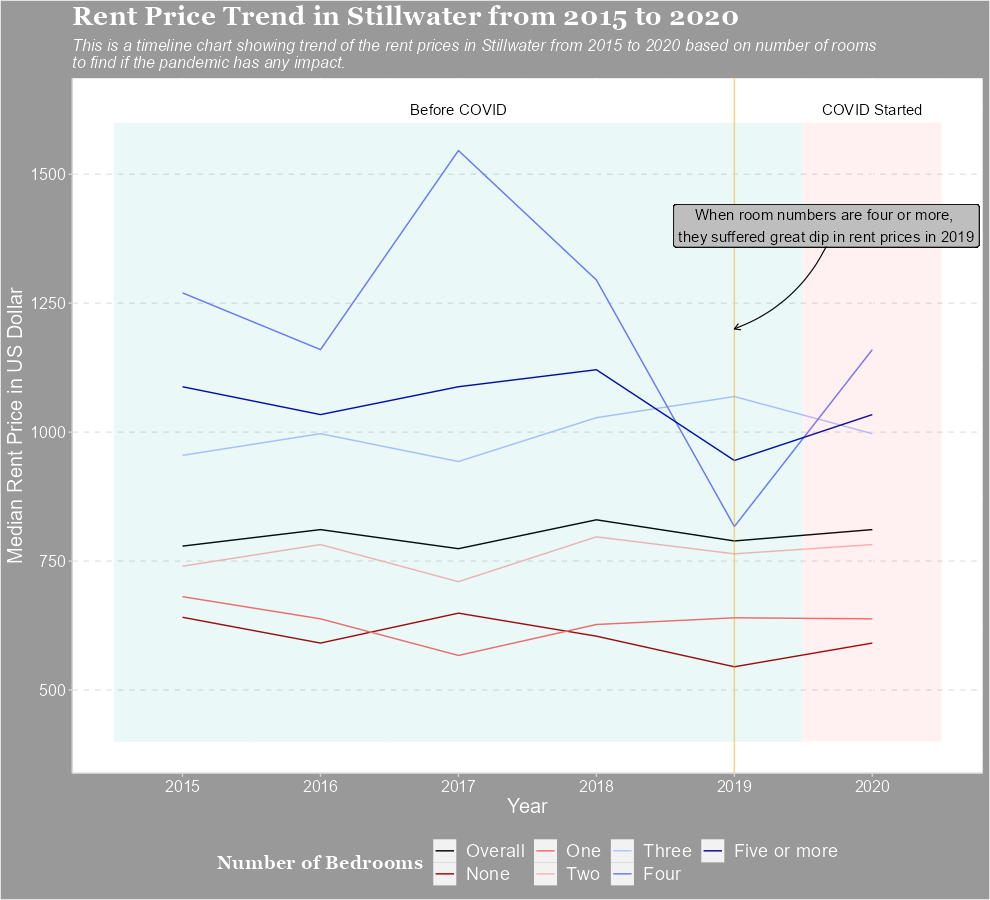 

Stillwater is a city in Payne County, Oklahoma. It is located in north-central Oklahoma at the intersection of U.S. Route 177 and State Highway 51. As of the 2010 census, the city population was 45,688, making it the tenth-largest city in Oklahoma. For our analysis, the choice of using median prices was made as the data obtained is not normally distributed according to census bureau. 

&nbsp;&nbsp;&nbsp;&nbsp;&nbsp;&nbsp;In 2015, Stillwater had rent prices ranging from $600/month for 1 bedroom apartments to $1280/month for 5 or more bedroom apartments. In overall, Stillwater has seen a steady but extremely slight increase in rent prices since. However, when we break it down to rent prices for different number of rooms, we can observe fluctuation in rent. 

&nbsp;&nbsp;&nbsp;&nbsp;&nbsp;&nbsp;The Financial year of 2019 saw the biggest dip in rent prices for housing unit with 4 or more rooms due to the spread of COVID-19. The university reduced the intake of international and out-of-state enrollments thus demand for housing and accomodation services dipped. This lead to the highest dip in rent prices since 2015 - 16. However, it is noticed that apartments that had bedrooms ranging from 0 to 3 did not receive a big hit. So, it seems like housing units with more rooms are preferred by the students. We will take a deeper view in this case in the next few analyses. It may be noticed that the prices for rent for apartments with 4 (or more) bedrooms actually increased in 2019 - 20. Rent prices have more or less stabilized after 2020-21 and have reached pre-pandemic levels. However, we would need more data for post-pandemic period to verify the stabilization of the rent price trend.  
**Key Take-away:** 
The key takeaway from this is, from an investor standpoint, apartments in Stillwater having 0 to 3 bedrooms is a low risk investment looking at the current data. However, the rent for 4-or-more-bedroom apartments is fairly unstable. It is worth to point out that before any concrete assumptions can be made, further data is required as for the scope of this analysis only data from Financial year of 2015 to 2020 is considered.  

### Rent Price Trend in Stillwater vs. OSU Enrollment

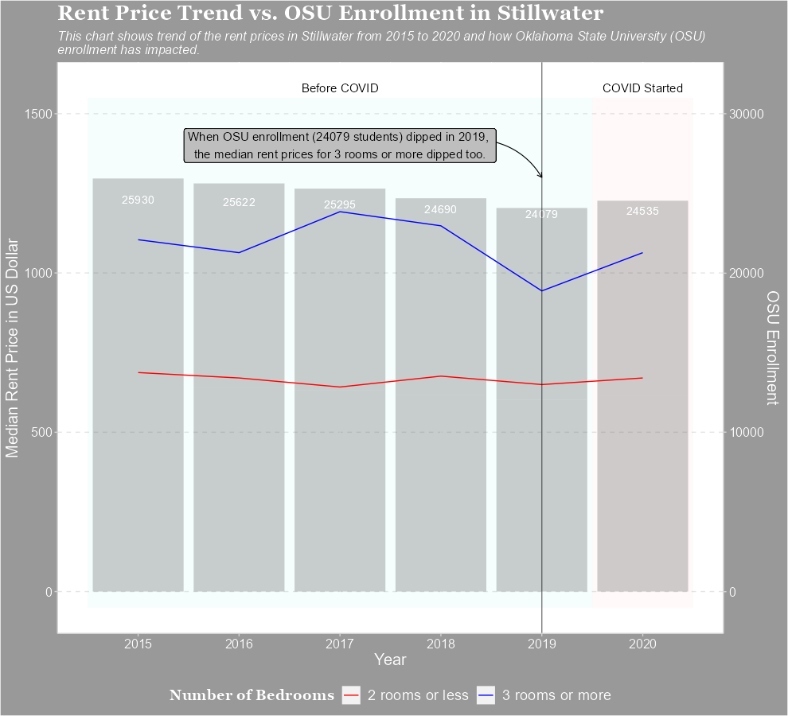 

OSU is a land-grant public university, OSU was founded in 1890 under the Morrill Act. Originally known as Oklahoma Agricultural and Mechanical College (Oklahoma A&M), it is the flagship institution of the Oklahoma State University System that holds more than 35,000 students across its five campuses with an annual budget of $1.5 billion. Students tend to live in 3-or-more-bedroom housing units, correspondingly a dip in the rent prices of these types of accommodation was observed as supply outstripped demand.  

&nbsp;&nbsp;&nbsp;&nbsp;&nbsp;&nbsp;Enrollment for OSU across all its campuses was the highest at 25,930 in the Academic year of 2015-16 and followed a decreasing trend over the years. The academic year of 2019-20 was the year where enrollment dropped to a low of 24079 students. The loss in enrollment numbers was not found to significantly different as a lot of students simply switched over to online classes. However, that phenomenon led to lower demand for accommodations as there were low number of students attending classes and staying in Stillwater. Based on the chart, the decrease in rent prices was not as severe as it occurred for 3-or-more-bedroom houses. For the year of 2020-21, OSU (2020) states that enrollment in Stillwater campus increased despite the global pandemic. This supported our case that at the end of Academic year 2020 - 21, the rent prices stabilized and returned to previous levels.   

**Key Take-away:** 
Looking at the graph, it can be reliably said that OSU enrollment numbers do play a significant role in determining the median rent prices for units with 3 rooms or more in Stillwater under normal circumstances. However, it could be seen that the prices for housing units with 2 bedrooms or less remained the same. Perhaps, the data we obtained covered the outskirt of Stillwater where housing units with 3 bedrooms or more were scarce and housing units with 2 bedrooms or less in the outskirts were not in high demand as housing units close to the campus causing the rent prices to remain stable. Another explanation for high demand in housing with more rooms among students is that students will be more likely to go for lower rental pay per pax and more rooms mean less rental per pax.   

### Rent Price vs. Property Value in Stillwater

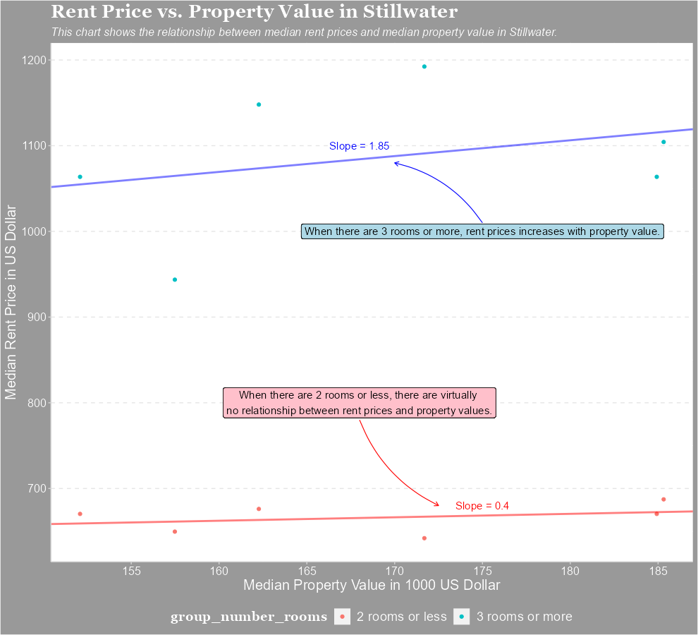 

Property market is volatile and it always impacts the rent prices. Stillwater as a town is a prime location in Oklahoma as it is a thriving community with around 50,000 permanent residents and in a location close to both Tulsa and Oklahoma City. Stillwater also gets about 23,000 new students each year at Oklahoma State University who contribute to the local economy. The crime rate and demographics of Stillwater are also a major contributor to the property values. Therefore, we decided to explore the relationship between rent and property values in Stillwater.   

&nbsp;&nbsp;&nbsp;&nbsp;&nbsp;&nbsp;
Based on our chart, the relationship between rent and property values in Stillwater is dependable on the number of bedrooms. For housing units with 3 or more bedroonms, the rent has a postive linear relationship with the property values. However, for housing units with 2 or less bedrooms, this is not true. Linear equations were created to gain a rough idea of what rent to expect given the value of the property is known:  

$$ Rent(for 3 or more bedrooms)=1.85⋅property value $$

$$ Rent(for 2 or less bedrooms)=0.4⋅property value $$

$$ Where, property value in 1000's $$

Based on the equations, for every 1000 USD increment in property value, rent will increase on average by 1.85 USD for housing units with 3 or more bedrooms while only 0.4 USD for housing units for 2 or less bedrooms. 

**Key Take-way:** 
Based on the equations, it can be concluded that on average, every 1000 USD investment increment on property (for renting purposes) in Stillwater, investors can have 1.45 USD more Return on Investment (ROI) if investing in housing units with 3 or more bedrooms than 2 or less bedrooms.  

### Rent Price vs. Population Age in Stillwater
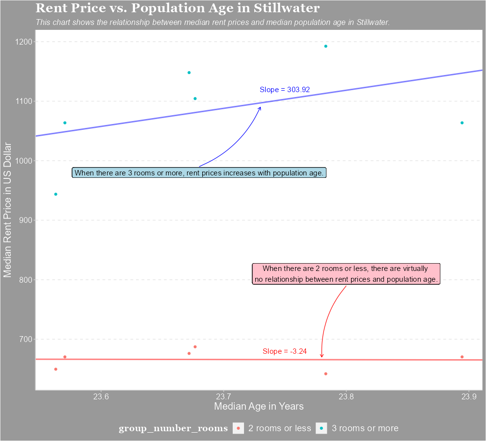 

According to US Census Bureau (2022), Stillwater is a young town with a median age of 23.5 years for males and 24.4 years for females, 75.3% of the population is between 18 and 65 years of age and 10% of the population is above 65 years of age. Stillwater mainly has residents from out of the area following a transitional lifestyle contributing to the increased demand for rental services. So, it comes to a question: do rent prices correlate with population age? 

&nbsp;&nbsp;&nbsp;&nbsp;&nbsp;&nbsp;Coming to the graph above, a clear trend can be observed for rooms having 3 or more bedrooms while rooms having 2 or less bedrooms show no clear trend. As the median age of the population increases, the rent prices for apartments having 3 or more bedrooms increases. One possible explanation is that when median age is higher, the population may have higher purchasing power with more family members resulting willingness to pay more for housing units with more rooms. This causes more competitive market on housing with more rooms as students have already demanded on them. Nevertheless, apartments having 2 or less bedrooms are tend to be too expensive for a student to afford causing a market less dependable to student population. Based on the chart, we are able to come with equations for both the types of apartments:

$$ Rent price for 3 or more bedroom properties (in USD) = 303.92 ⋅ Median age (in years) $$

$$ Rent price for 2 or less bedroom properties (in USD) = -3.24 ⋅ Median age (in years) $$

Based on the equations, for every 1 year increment in median, rent will increase on average by 303.92 USD for housing units with 3 or more bedrooms while rent will decrease by 3.24 USD for housing units for 2 or less bedrooms. 

**Key Take-way:**

Population age is a significant predictor for rent prices of housing units with 3 rooms or more in Stillwater. If population age is high, rent prices of housing units with 3 rooms or more will be high too. When it comes to housing units with 2 rooms or less, population age will not have significant impact on rent prices in Stillwater.  

## Conclusion and Discussion

### Summary of our Findings

Although there is just a slight increment in overall trend of rent prices, when rent prices are broken down according to number of rooms per housing unit, we can observe something interesting. According to our analysis, COVID-19 pandemic, OSU enrollment, property value in Stillwater, and population age in Stillwater are significant variables influencing rent prices in Stillwater especially housing units with 3 or more bedrooms. Summary of our findings are as follows:

- Housings in Stillwater having 0 to 2 bedrooms are stable in rent prices while the rent prices for 3-or-more-bedroom housing units are unstable.
- Students prefer 3-or-more-bedroom units because it is more affordable than 2-or-less-bedroom units when it comes to sharing of rental.
- When COVID-19 hit, OSU on-campus enrollment dropped resulting a dip in demand and rent price for 3-or-more-bedroom units. 
- On average, every 1000 USD investment increment on property (for renting purposes) in Stillwater, investors can have 1.45 USD more ROI investing in housing units with 3 or more bedrooms than 2 or less bedrooms.
- Population age is a significant predictor for rent prices of housing units with 3 rooms or more in Stillwater. If population age is high, rent prices of housing units with 3 rooms or more will be high too. 

### Implications of this Project

1. Incoming Students, Existing Students, People of Stillwater  
*To gain information on housing demand and expected housing expenses for financial management* 
- Enrollment at OSU can be generally used to determine the rent prices (especially housing units with 3 or more bedrooms) in Stillwater cannot be reliably used under unexpected circumstances.
- If a year has high enrollment numbers, it is recommended for the student to go for a 2-or-less bedroom apartment as the price for that apartment will not fluctuate as much. 
- Renewing the lease earlier can benefit the students who are staying in units with more bedrooms in case that an increase in enrollment numbers can be seen in following years.
2. Statisticians and Analysts, Real Estate & Housing Businesses, City of Stillwater  
*To maintain competitiveness in rent prices, to prevent overpricing in rent, and to plan housing development efficiently according to forecasted demand.* 
- Market for rentals of 0-to-2-bedroom apartments is stable and has lower risk compared to rentals for 3 or more-bedroom apartments.
- Population age can be used to forecast rent prices due to the fact that it portrays market competition among students and locals on housing units with 3 or more bedrooms.
- Property values play a significant role on rent prices for housing units with 3 or more bedrooms but not housing units with 2 or less bedrooms.
3. Overall Public 
*To have a big picture of demographics and property/rent information of Payne County.*  
- Stillwater is a young town with a median age of 23.5 years for males and 24.4 years for females.
- Property values in Stillwater remain competitive but COVID-19 has caused a dip.
- Rent price in Stillwater remain stable in overall but highly dependable on OSU enrollment when it comes to housing with more rooms.

### Issues and Challenges

1. Only 6 rows of data (data from year 2015 to 2020) are available in consolidated csv file [final_rent.csv](data/consolidated/final_rent.csv).

2. Some useful websites for example https://www.rentdata.org/ and https://www.apartments.com/ are blocked from scraping due to legal issue. Using `website/robots.txt` allows us to check if a website is blocked from scraping.

3. Dataset like [employment by industries](data/transformed/emp_industry/emp_industry.csv) are tough to consolidate and merge into 1 table without making the consolidated data too complex to analyse due to multiple nominal categories. 

### Recommended Solutions

1. For Issue 1:
- Some websites store data with a timeframe of only up to a few years. We should start collecting data early before the websites removing the older data. Perhaps, manual data collection like surveys can be done. However, this solution will be extremely time-consuming.
- If the project objectives are more general, datasets with older observations can be easily found and scraped. So, we can provide more insights from the dataset; yet, it sacrifices specificity of objectives.

2. For Issue 2:
- Contacting the owner or manager of blocked websites are one of the ways to scrape blocked websites. However, risk of being rejected or delayed in response cannot be ignored especially with tight timeframe.
- Some websites, though blocked, have their data collected from general or public source like census data. Locating the public source could be another way to bypass blocked websites.

3. For Issue 3:
- Thorough investigation on necessity of the mentioned data could be conducted to see if the data is necessary for the analysis. This could avoid wasting time on unnecessary dataset.
- If it turns out significant, we could try separate to data from the master table and design an entity relationship diagram to connect the tables. If analysis is required, we could join the data using primary and foreign key into a dataframe and analyze it.  

## References 
Charles, Michelle. *City of Stillwater Continues COVID Assistance with Phase 3 Rent and Utility Aid.* Stillwater News Press, 24 Mar. 2022, https://autos.yahoo.com/city-stillwater-continues-covid-assistance-050400868.html. 

Jones, Dawn. *City of Stillwater Applies for Grant Funding to Begin Rail-to-Trail Project.* Stillwater News, 22 Nov. 2022, http://stillwater.org/news/view/id/774. 

Mize, Richard. *It's Not Bedlam, but Stillwater Beats Norman When It Comes to Apartment Living.* The Oklahoman, Oklahoman, 11 Aug. 2022, https://www.oklahoman.com/story/business/real-estate/2022/08/11/oklahoma-college-towns-stillwater-norman-among-cheapest-rent/65398735007/. 

Oklahoma State University. *OSU’s undergraduate enrollment reaches historic high in Stillwater.* OSU Headlines, 18 Sep. 2017, https://news.okstate.edu/articles/communications/2017/osu-s-undergraduate-enrollment-reaches-historic-high-stillwater.html. 

Oklahoma State University. *OSU enrollment rises despite the global pandemic.* OSU Headlines, 1 Sep. 2020, https://news.okstate.edu/articles/communications/2020/osu-enrollment-rises-despite-the-global-pandemic.html. 

United States Census Bureau. *QuickFacts.* United States Census Bureau, 1 Jul. 2021, https://www.census.gov/quickfacts/stillwatercityoklahoma. 